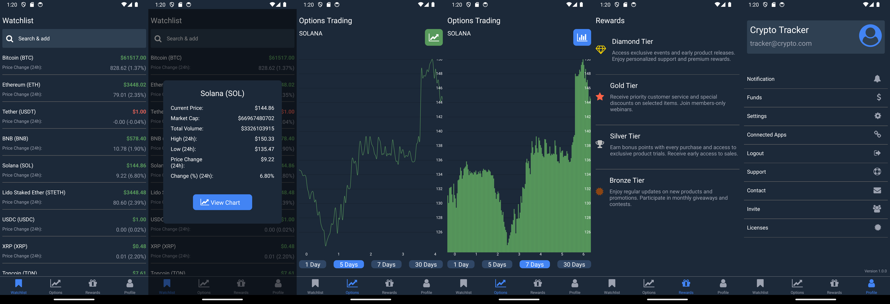
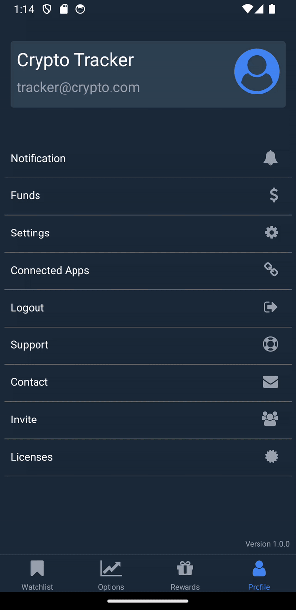

# CryptoPortfolioTracker

CryptoPortfolioTracker is a React Native application that allows users to track cryptocurrency prices, view detailed charts, manage their crypto portfolio, and view rewards earned through app usage.

## Features

- **Home Screen**: Browse and search for cryptocurrencies, view their current prices and 24-hour changes.
- **Options Screen**: View detailed charts for selected cryptocurrencies over various time periods.
- **Profile Screen**: View user profile information.
- **Rewards Screen**: Placeholder for displaying rewards earned through app usage.

## Screenshots
  
  

## Demo
  


## Installation

To get started with the project, follow these steps:

1. **Clone the repository**:

    ```sh
    git clone https://github.com/sabarikennady/CryptoPortfolioTracker.git
    cd CryptoPortfolioTracker
    ```

2. **Install dependencies**:

    ```sh
    yarn install
    ```

3. **Set up environment variables**:

    Create a `.env` file in the root directory with the following variables:
    ```
    API_BASE_URL=your_api_base_url
    ```

4. **Start the project**:

    - For Android:

      ```sh
      yarn start
      yarn android
      ```

    - For iOS:

      ```sh
      yarn start
      yarn ios
      ```

5. **Run tests**:

    ```sh
    yarn test
    ```

6. **Lint the project**:

    ```sh
    yarn lint
    ```

## Project Structure

- **HomeScreen**: Allows users to search and browse through a list of cryptocurrencies, view current prices, and open detailed charts.
- **OptionsScreen**: Displays detailed charts for selected cryptocurrencies over different time periods. It dynamically updates based on the cryptocurrency selected from the HomeScreen.
- **ProfileScreen**: Shows dummy user profile data.
- **RewardsScreen**: Placeholder for displaying rewards earned through app usage.

## Navigation

The app uses a bottom tab navigator for navigation between the screens. The tabs include:

- **Home**
- **Options**
- **Profile**
- **Rewards**

## Dependencies

The project relies on the following key dependencies:

- `axios`: For making HTTP requests to fetch cryptocurrency data.
- `react-navigation`: For navigating between screens.
- `react-native-svg-charts`: For rendering charts.
- `react-native-vector-icons`: For using vector icons in the app.

## Contributing

If you would like to contribute to this project, please follow these steps:

1. Fork the repository.
2. Create a new branch.
3. Make your changes.
4. Submit a pull request.

## License

This project is licensed under the MIT License.
